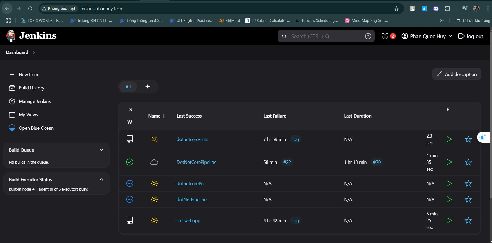
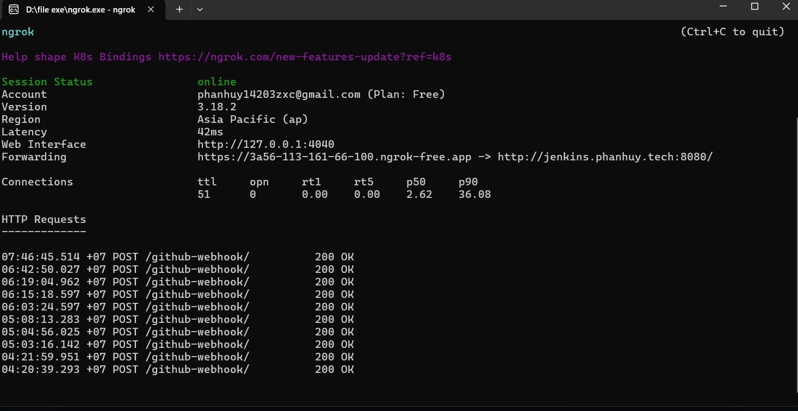
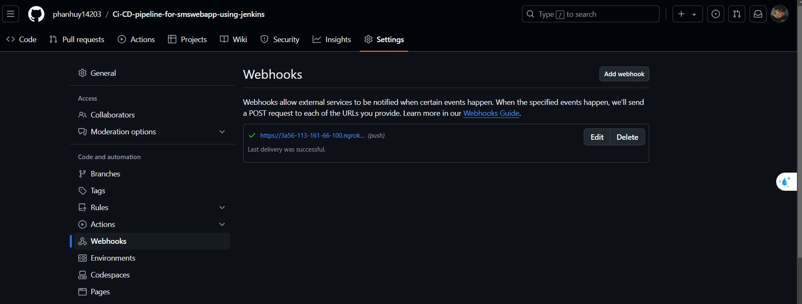
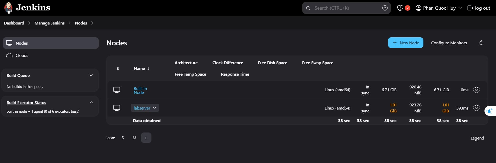
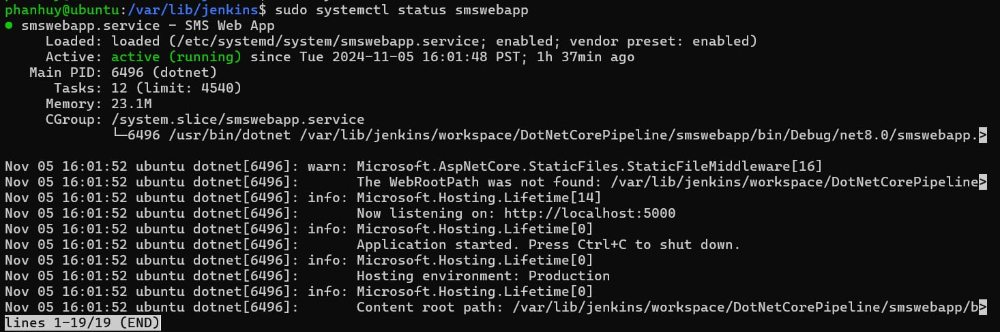
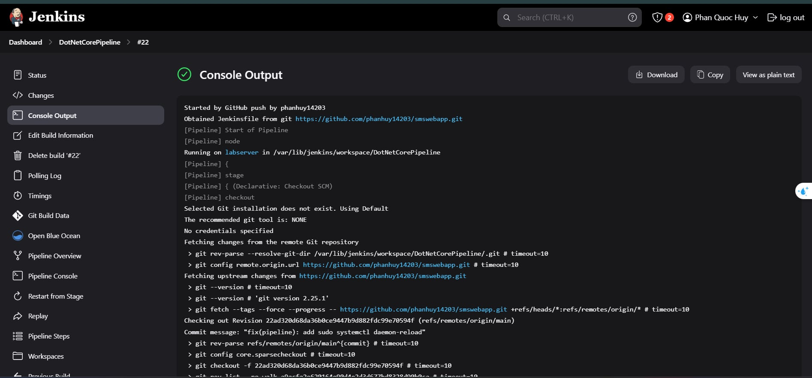
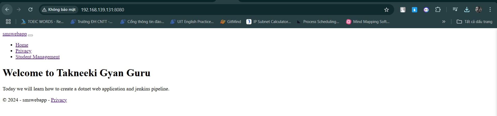
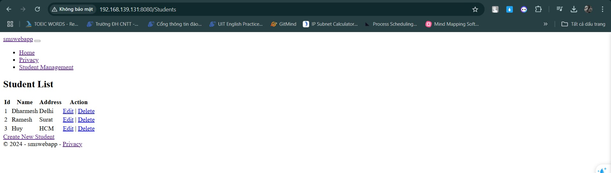

# CI-CD-pipeline-for-dotnetCoreapp-using-jenkins
## 📌Summary of steps
### Step 1: Prepare 2 virtual machines that serve as the Jenkins server and the web server.
### Step 2: Integrate GitHub and Jenkins via Webhook, using ngrok to assist in this process.
### Step 3: Install Jenkins agent on the node and connect it to the Jenkins server.
### Step 4: Service and web server configuration: using systemd and nginx to support this process.
### Step 5: Grant permissions to the jenkins user to execute sudo commands without needing to enter a password.
### Step 6: Write a Jenkinsfile to define the pipeline.
## 📌Step 1: Prepare 2 virtual machines that serve as the Jenkins server and the web server.
### Install Jenkins on the Linux operating system
```
#!/bin/bash
sudo apt install openjdk-17-jdk -y
java --version
wget -p -O - https://pkg.jenkins.io/debian/jenkins.io.key | apt-key add -
sh -c 'echo deb http://pkg.jenkins.io/debian-stable binary/ > /etc/apt/sources.list.d/jenkins.list'
apt-key adv --keyserver keyserver.ubuntu.com --recv-keys 5BA31D57EF5975CA
apt-get update
apt install jenkins -y
systemctl start jenkins
ufw allow 8080
```
#### Update /etc/hosts for Jenkins hostname on linux
```
ip-of-jenkins-server jenkins.phanhuy.tech
```
#### Update C:\Windows\System32\drivers\etc\hosts on Window
```
ip-of-jenkins-server jenkins.phanhuy.tech
```
#### Configure Nginx as a reverse proxy for Jenkins.
Create conf.d/jenkins.phanhuy.tech.conf at /etc/nginx
```
server {
listen 80;
server_name jenkins.elroydevops.tech;
location / {
  proxy_pass http://jenkins.phanhuy.tech:8080;
  proxy_http_version 1.1;
  proxy_set_header Upgrade $http_upgrade;
  proxy_set_header Connection keep-alive;
  proxy_set_header Host $host;
  proxy_cache_bypass $http_upgrade;
  proxy_set_header X-Forwarded-For $proxy_add_x_forwarded_for;
  proxy_set_header X-Forwarded-Proto $scheme;
}
}
```
Result:

### Install .NET SDK on the web server.
```
wget https://packages.microsoft.com/config/ubuntu/$(lsb_release -rs)/packages-microsoft-prod.deb
```
```
sudo dpkg -i packages-microsoft-prod.deb
```
```
sudo apt update
```
```
sudo apt install -y dotnet-sdk-8.0
```
## 📌Step 2: Integrate GitHub and Jenkins via Webhook, using ngrok to assist in this process.
### Install ngrok on Windows.
Visit the official ngrok website: [ngrok.com](https://download.ngrok.com/windows?tab=download)
### Authenticate ngrok.
```
ngrok authtoken YOUR_AUTH_TOKEN
```
### Run ngrok 
```
ngrok http http://jenkins.phanhuy.tech:8080
```
### Result:

### Use the URL from ngrok to set up a webhook connection between GitHub and Jenkins.
Result:

## 📌Step 3: Install Jenkins agent on the node and connect it to the Jenkins server.
### Add new node at Dashboard/Manage Jenkins/Nodes with the Launch method set to 'Launch agent by connecting it to the controller'
### create a file named secret-file that contains a secret token or secret key
```
echo your_secret_key > secret-file
```
### download the agent.jar file from the specified URL
```
curl -sO http://your_url/jnlpJars/agent.jar
```
### launch a Jenkins agent on a server
```
http://jenkins.phanhuy.tech:8080/ -secret @secret-file -name your-node-label -webSocket -workDir "your-path" > nohub.out 2>&1 &
```
Result: 

## 📌Step 4: Service and web server configuration: using systemd and nginx to support this process.
### Create or edit a service file for a systemd service on the web server.
```
sudo nano /etc/systemd/system/smswebapp.service
```
### With the content being:
```
Description=SMS Web App
After=network.target

[Service]
WorkingDirectory=/var/lib/jenkins/workspace/DotNetCorePipeline/smswebapp/bin/Debug/net8.0
ExecStart=/usr/bin/dotnet /var/lib/jenkins/workspace/DotNetCorePipeline/smswebapp/bin/Debug/net8.0/smswebapp.dll 
Restart=always
TimeoutStopSec=20
Environment=ASPNETCORE_ENVIRONMENT=Production

[Install]
WantedBy=multi-user.target
```
### Create and configure a reverse proxy for the web server similar to that of the Jenkins server with port 8080.
```
sudo nano /etc/nginx/sites-available/smswebapp
```
Result: 

## 📌Step 5: Grant permissions to the jenkins user to execute sudo commands without needing to enter a password.
### Depending on which sudo commands are used in the Jenkins file, grant additional permissions to the jenkins user to use those sudo commands without needing to enter a password.
```
sudo visudo
```
### My configuration
```
jenkins ALL=(ALL) NOPASSWD: /usr/bin/dotnet*
jenkins ALL=(ALL) NOPASSWD: /bin/systemctl daemon-reload
jenkins ALL=(ALL) NOPASSWD: /bin/systemctl restart smswebapp
jenkins ALL=(ALL) NOPASSWD: /bin/systemctl start smswebapp
jenkins ALL=(ALL) NOPASSWD: /bin/systemctl stop smswebapp
```
## 📌Step 6: Write a Jenkinsfile to define the pipeline.
### 1. Add New Item at Dashboard of Jenkins
### 2. Create an item name and Select an item type (I choose pipeline.)
### 3. Select Build Triggers as GitHub hook trigger for GITScm polling, in the Pipeline section choose Definition as Pipeline script from SCM with SCM as Git, then select Repository URL as https://github.com/phanhuy14203/Ci-CD-pipeline-for-smswebapp-using-jenkins.git, branch as main, and Script Path as Jenkinsfile.
### 4. Create Jenkinsfiles with appropriate stages to deploy .NET Core web.
### 5. When developers push code changes to the repository, a pipeline is triggered to build, test, and deploy the application.
### 6. Check the Console Output to see the detailed results of the stages in the pipeline.
Example: 
### 7. Check the website with the URL http://web-server-ip:8080/
Result: 


